

  <a href="https://github.com/Raseraa0">
   🏠 Go back to my GitHub home page 🏠 
  </a>

---

# 📌 Wallpaper Generator

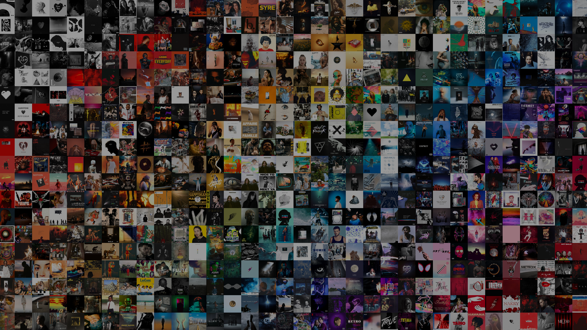

## 📝 Overview

A `Python` project whose initial goal was to create a nice `wallpaper` based on the `covers` of my favorite music albums. This is my first real project, and I had the opportunity to make it evolve over the years, by adding a program that will directly retrieve all the covers of a certain Spotify playlist.

When I started this project, I was already happy with the result even though I only had 100 images. I'll let you look at the results I have now that I have more than 600.

  
  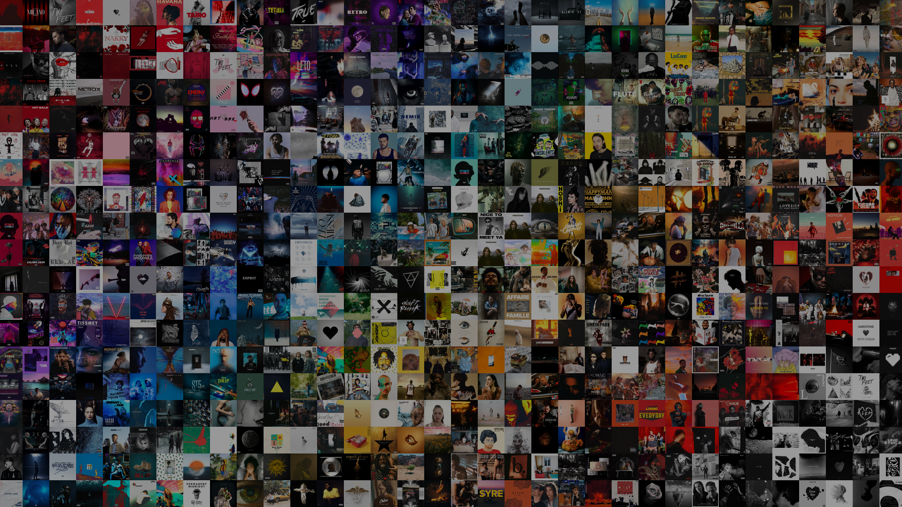
  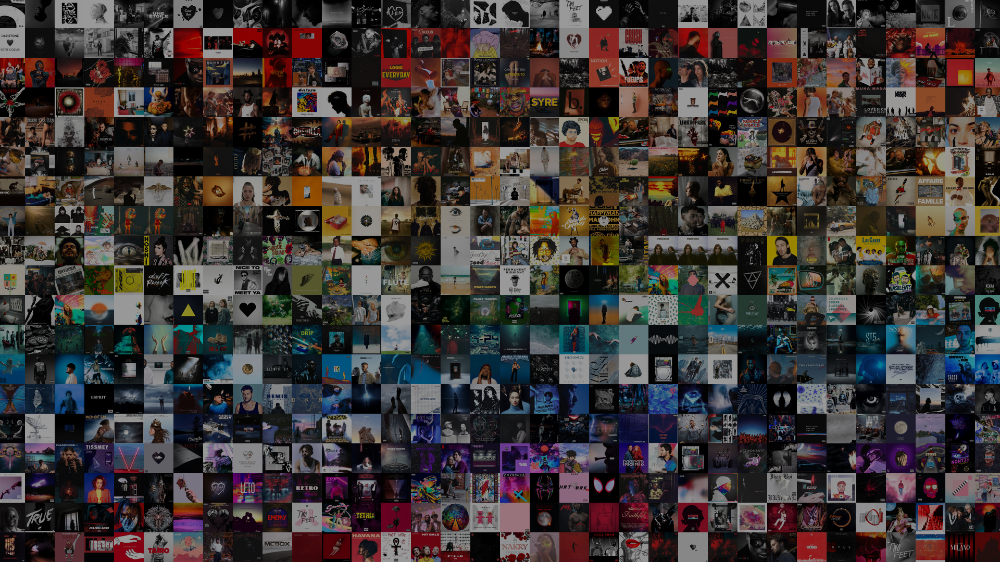
  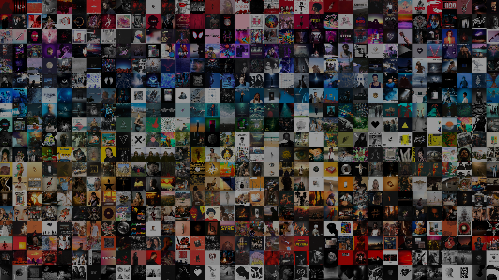
  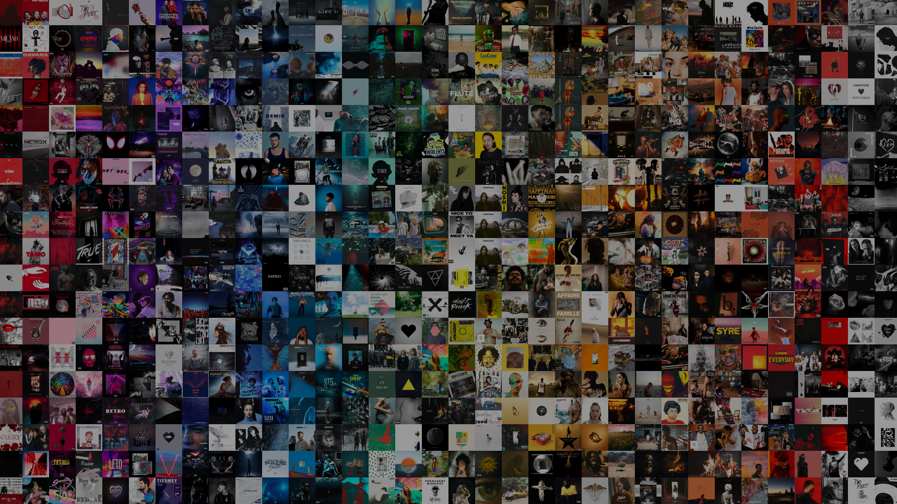
  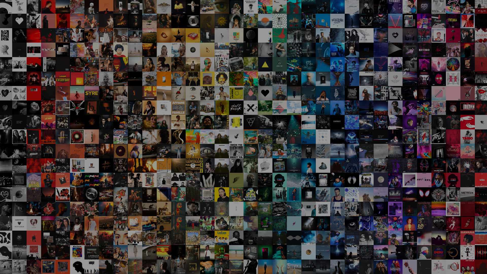

  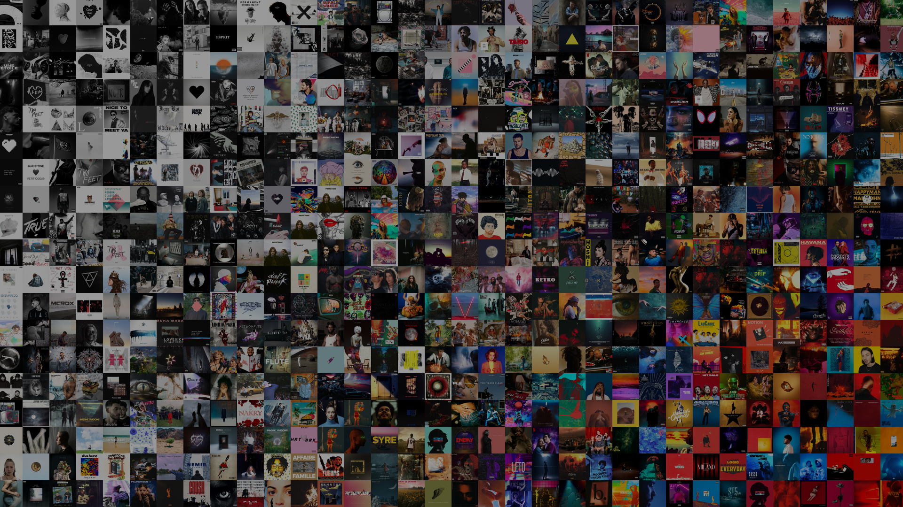
  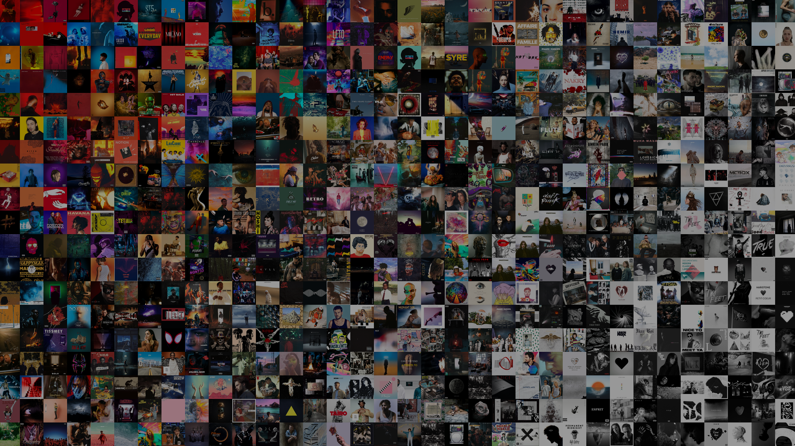
  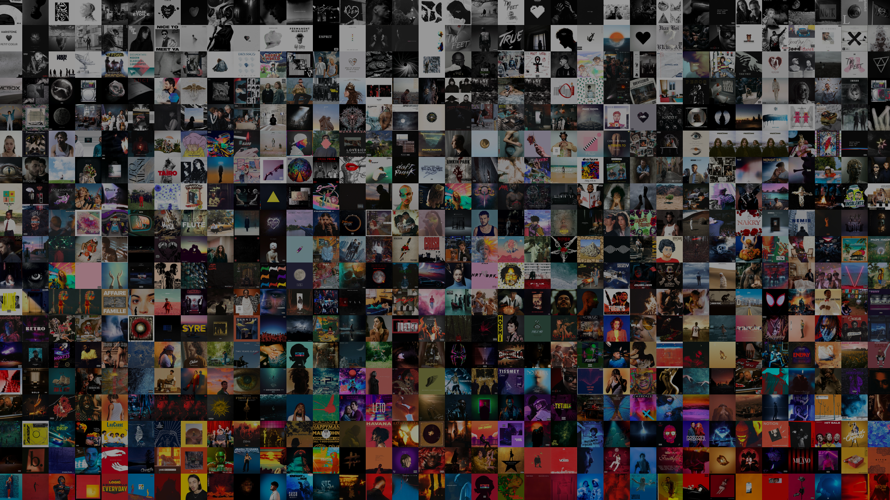
  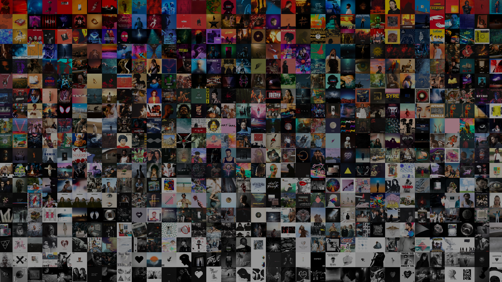
  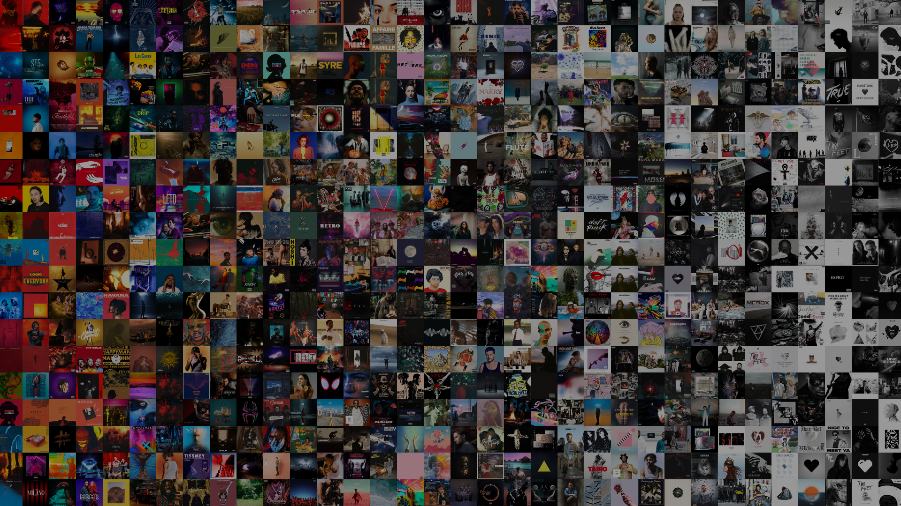
  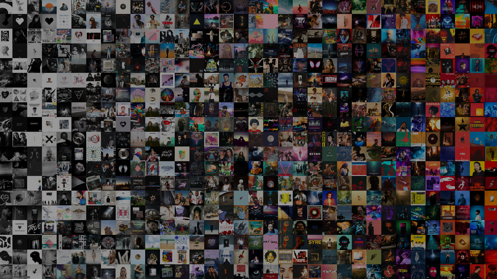

  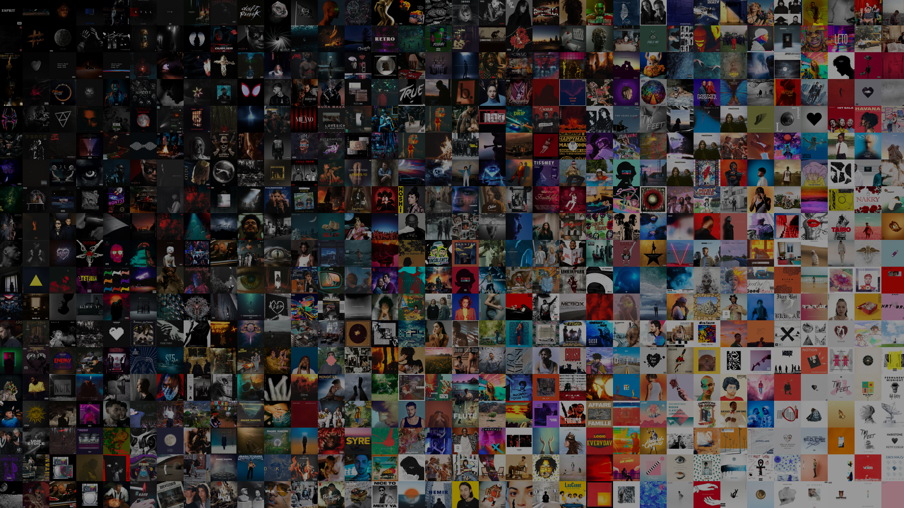
  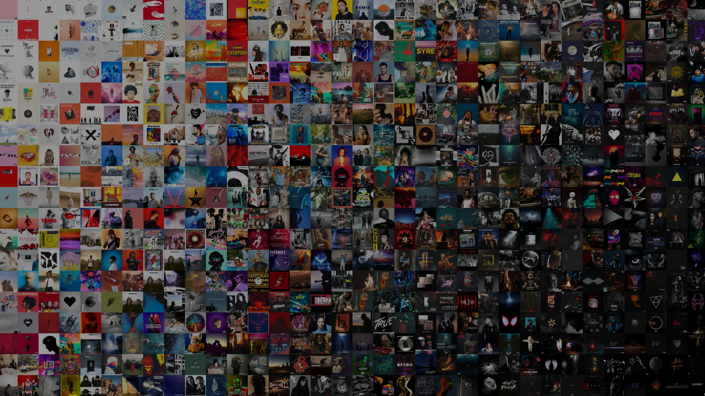
  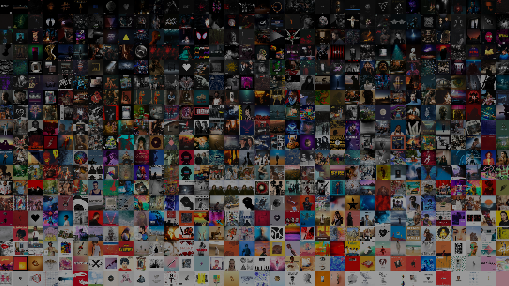
  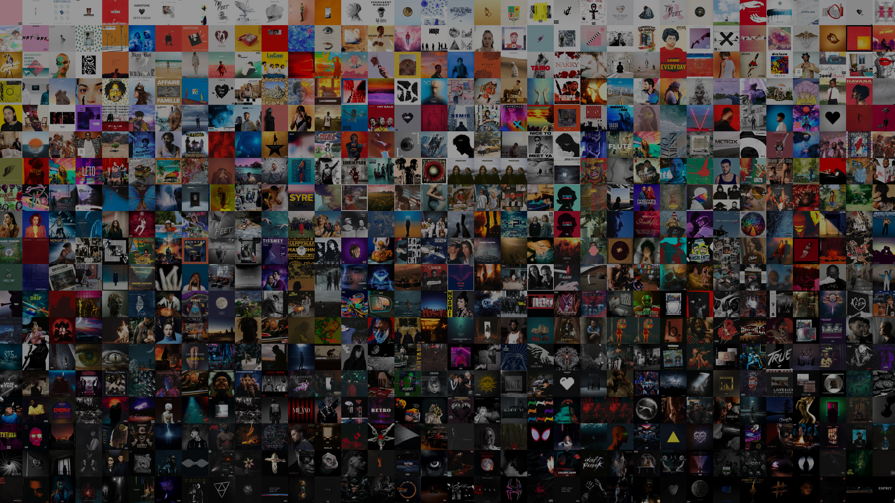
  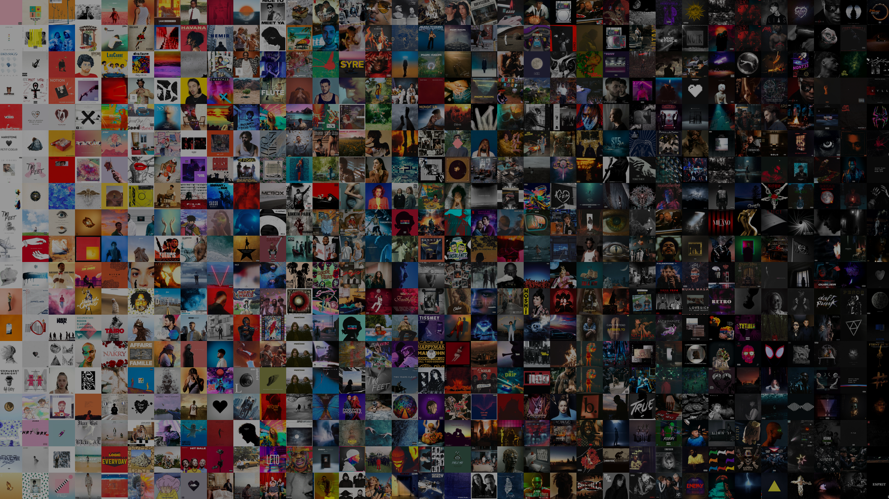
  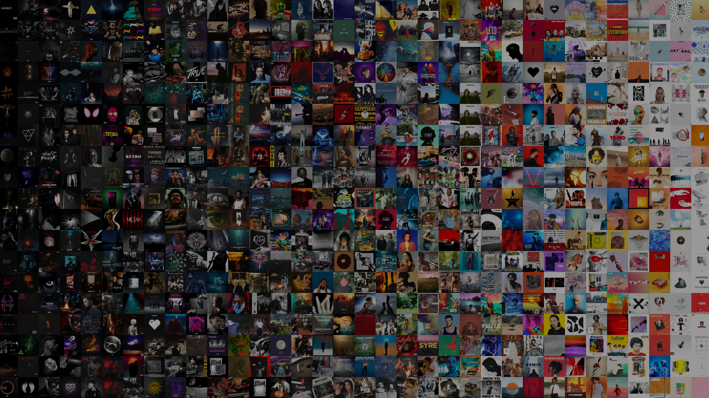

## 🧰 Toolbox

---

  <a href="https://github.com/Raseraa0">
   🏠 Go back to my GitHub home page 🏠 
  </a>

